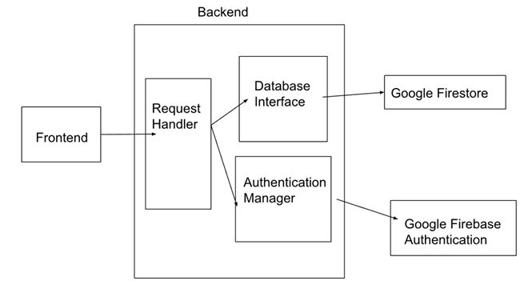

# Introduction

## What is Bell-i?

This website helps students find the best food spots on the UIUC campus by providing a platform for restaurant and dish ratings. It allows students to:

- Browse and filter restruarants based on their cuisine, price, and rating
- Rate restaurants based on taste, price, location, and environment
- Rate individual dishes
- View their own past ratings
- Read reviews from other students

For more details, view the full project proposal [here](https://docs.google.com/document/d/1McGJUzmLfTR4rOQUi90OATK83LW2lYW-f-hpjCZkLSs/edit?usp=sharing).

# Technical Architecture



# Developers

- **Kevin Yang:** Backend development, Firebase integration, user profile functionality, and database design
- **Lamija Cenan:** Backend development, Firebase integration, authentication, and testing
- **Angela He:** Frontend development, UI design, styling, and frontend feature implementation
- **Mayumi Suzue-Pan:** Frontend development, dish rating functionality, UI design, and styling

# Environment Setup

## Requirements

- Node.js (v16 or later)
- npm
- A Firebase project with Firestore and Email/Password Authentication enabled

## Clone the repository
Navigate to your source directory and run the following command.
```js
git clone https://github.com/CS222-UIUC/fa25-team33.git
cd fa25-team33
```
## Install dependencies
Install all required packages:
```js
npm install
```

## Running the Application
Start the development server:
```js
npm run dev
```

# Development

## Firebase Configuration

To configure Firebase:

1. Create a Firebase project
2. Enable Firestore Database
3. Enable Email/Password Authentication
4. Create or update `src/firebase.ts` with your Firebase credentials:
```js
import { initializeApp } from 'firebase/app';
import { getAuth } from 'firebase/auth';
import { getFirestore } from 'firebase/firestore';

const firebaseConfig = {
  apiKey: "YOUR_API_KEY",
  authDomain: "YOUR_AUTH_DOMAIN",
  projectId: "YOUR_PROJECT_ID",
  storageBucket: "YOUR_STORAGE_BUCKET",
  messagingSenderId: "YOUR_MESSAGING_SENDER_ID",
  appId: "YOUR_APP_ID"
};

const app = initializeApp(firebaseConfig);
export const auth = getAuth(app);
export const db = getFirestore(app);
```
4. Set up Firestore collections:
- `user_profiles`: User information
- `ratings`: Restaurant ratings
- `dishRatings`: Dish ratings

# Project Instructions

1. Create an Account
    - Click "Get Started" on the discovery page
    - Enter credentials
    - Click "Sign Up"

2. Browse Restaurants
    - Navigate to the discovery page to view a list of restaurants
    - Filter by cuisine, price level, or minimum rating

3. Rate a Restaurant
    - Click on a restaurant and rate on taste, price, location, and environment
    - Add a written review optionally
    - Submit rating

4. Rate a Menu Item
    - Click on the stars next to a dish to rate it

5. View Your Profile
    - Click on "Profile" at the top of the discovery page
    - View your rating history of restaurants and menu items
 it shows that i cmmoited it in my last pr but it doesnt actually show up at the bottom